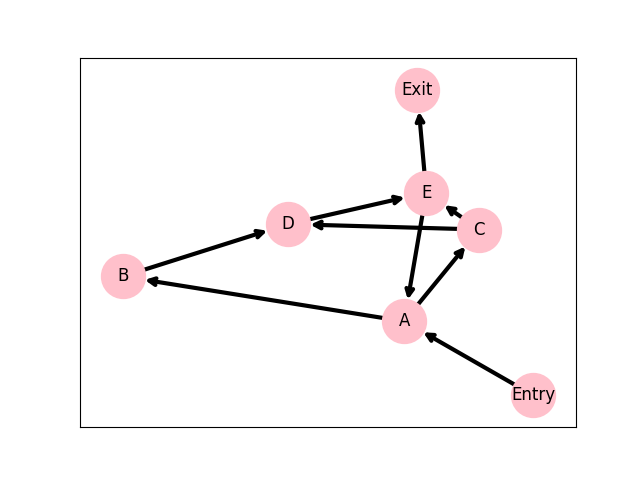
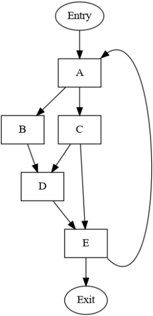
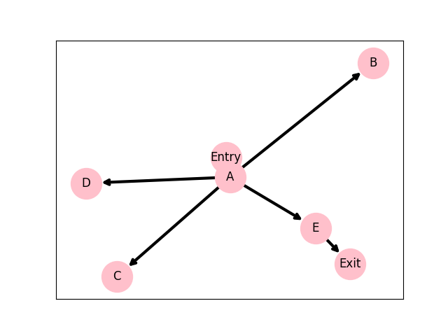
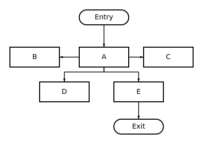

### Control Flow Graph

| matplotlib | base  |
|:---|:---|
|  |  |

### Dominator Tree

| matplotlib | handmade  |
|:---|:---|
|  |  |

| node=      | Entry   | A        | B           | C           | D           | E           | Exit              |
|:-----------|:--------|:---------|:------------|:------------|:------------|:------------|:------------------|
| Pred(node) | None    | Entry, E | A           | A           | B, C        | C, D        | E                 |
| Dom(node)  | Entry   | Entry, A | Entry, A, B | Entry, A, C | Entry, A, D | Entry, A, E | Entry, A, E, Exit |
| Idom(node) | None    | Entry    | A           | A           | A           | A           | E                 |
| DF(node)   | None    | A        | D           | D, E        | E           | A           | None              |

```code
B = {B} + (Dom(A)) = {B} + ({A}) = {A, B}
C = {C} + (Dom(A)) = {C} + ({A}) = {A, C}
D = {D} + (Dom(B) * Dom(C)) = {D} + ({A, B} * {A, C}) = {A, D}
E = {E} + (Dom(C) * Dom(D)) = {E} + ({A, C} * {A, D}) = {A, E}
===========================
A = {A} + (Dom(E)) = {A} + ({A, E}) = {A, E}
B = {B} + (Dom(A)) = {B} + ({A, E}) = {A, E, B}
C = {C} + (Dom(A)) = {C} + ({A, E}) = {A, E, C}
D = {D} + (Dom(B) * Dom(C)) = {D} + ({A, B, E} * {A, C, E}) = {A, E, D}
E = {E} + (Dom(C) * Dom(D)) = {E} + ({A, C, E} * {A, D, E}) = {A, E}
IDoms: (A, -), (B, A), (C, A), (D, A), (E, A)

Pred(A) = {Entry, E}, IDom(A) = {Entry}
E -> A: DF(E) += {A}
A -> Entry: DF(A) += {A}
Pred(D) = {B, C}, IDom(D) = {A}
B -> A: DF(B) += {D}
C -> A: DF(C) += {D}
Pred(E) = {C, D}, IDom(E) = {A}
C -> A: DF(C) += {E}
D -> A: DF(D) += {E}
Boundaries: (Entry: {}), (A: {A}), (B: {D}), (C: {D, E}), (D: {E}), (E: {A}), (Exit: {})
```
