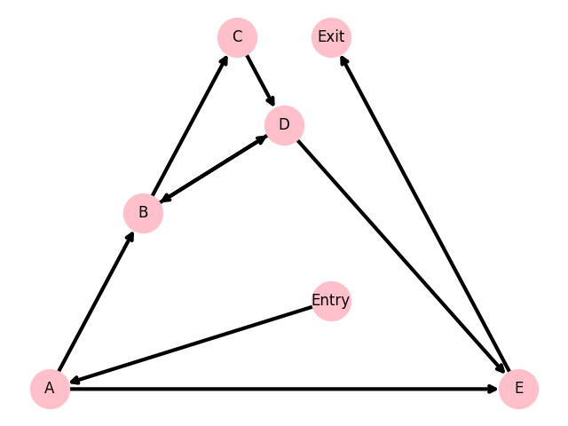

```
Entry

Block A [4]
(1) 	k <-- n
(2) 	b <-- #1
(3) 	c <-- a
(4) 	ifTrue k = #0 goto L4

Block B [2]
(5) 	L1: t1 <-- %mod, k, #2
(6) 	ifFalse t1 = #0 goto L2

Block C [3]
(7) 	k <-- %div, k, #2
(8) 	c <-- *, c, c
(9) 	goto L3

Block D [2]
(10)	b <-- *, b, c
(11)	c <-- *, b, c

Block E [4]
(12)	L2: k <-- -, k, #1
(13)	k <-- %div, k, #2
(14)	c <-- *, c, c
(15)	b <-- *, b, c

Block F [1]
(16)	L3: goto L1

Block G [2]
(17)	c <-- *, c, c
(18)	k <-- %div, k, #4

Block H [1]
(19)	L4: return c

Exit
```

Detached blocks : ```{D, G}```

### Control Flow Graph



### Dominator Tree


| node =     | Entry   | A        | B           | C              | E              | F              | H           | Exit              |
|:-----------|:--------|:---------|:------------|:---------------|:---------------|:---------------|:------------|:------------------|
| Pred(node) | None    | Entry    | A, F        | B              | B              | C, E           | A           | H                 |
| Dom(node)  | Entry   | Entry, A | Entry, A, B | Entry, A, B, C | Entry, A, B, E | Entry, A, B, F | Entry, A, H | Entry, A, H, Exit |
| Idom(node) | None    | Entry    | A           | B              | B              | B              | A           | H                 |
| DF(node)   | None    | None     | B           | F              | F              | B              | None        | None              |

| var =       | a    | b    | c       | k       | n    | t1    |
|:------------|:-----|:-----|:--------|:--------|:-----|:------|
| Blocks(var) | None | A, E | A, C, E | A, C, E | None | B     |
| is Global   | True | True | True    | True    | True | False |

### Needs a phi-function:

| block =   | Entry   | A   | B   | C   | D   | E   | F   | G   | H   | Exit   |
|:----------|:--------|:----|:----|:----|:----|:----|:----|:----|:----|:-------|
| n         | -       | -   | -   | -   | -   | -   | -   | -   | -   | -      |
| k         | -       | -   | +   | -   | -   | -   | +   | -   | -   | -      |
| b         | -       | -   | +   | -   | -   | -   | +   | -   | -   | -      |
| c         | -       | -   | +   | -   | -   | -   | +   | -   | -   | -      |
| a         | -       | -   | -   | -   | -   | -   | -   | -   | -   | -      |
| t1        | -       | -   | -   | -   | -   | -   | -   | -   | -   | -      |

```
Rename(Entry):
    no phi-functions
    no instructions
    fill(A):
        no phi-functions
    Rename(A):
        no phi-functions
        rename instructions:
            k₀ <-- n₀
            b₀ <-- #1
            c₀ <-- a₀
            ifTrue k₀ = #0 goto L4
        fill(H):
            no phi-functions
        fill(B):
            b₀ <-- phi(b₀)
            c₀ <-- phi(c₀)
            k₀ <-- phi(k₀)
        Rename(H):
            no phi-functions
            rename instructions:
                L4: return c₀
            fill(Exit):
                no phi-functions
            Rename(Exit):
                no phi-functions
                no instructions
                clean();
                return to H;
            clean();
            return to A;
        Rename(B):
            rename phi-functions:
                b₁ <-- phi(b₀)
                c₁ <-- phi(c₀)
                k₁ <-- phi(k₀)
            rename instructions:
                L1: t1 <-- %mod, k₁, #2
            fill(E):
                no phi-functions
            fill(C):
                no phi-functions
            Rename(C):
                no phi-functions
                rename instructions:
                    k₂ <-- %div, k₁, #2
                    c₂ <-- *, c₁, c₁
                fill(F):
                    b₀ <-- phi(b₁)
                    c₀ <-- phi(c₂)
                    k₀ <-- phi(k₂)
                clean();
                return to B;
            Rename(E):
                no phi-functions
                rename instructions:
                    L2: k₃ <-- -, k₁, #1
                    k₄ <-- %div, k₃, #2
                    c₃ <-- *, c₁, c₁
                    b₂ <-- *, c₃, c₃
                fill(F):
                    b₀ <-- phi(b₁, b₂)
                    c₀ <-- phi(c₂, c₃)
                    k₀ <-- phi(k₂, k₄)
                clean();
                return to B;
            Rename(F):
                rename phi-functions:
                    b₃ <-- phi(b₁, b₂)
                    c₄ <-- phi(c₂, c₃)
                    k₅ <-- phi(k₂, k₄)
                no instructions
                fill(B):
                    b₁ <-- phi(b₀, b₃)
                    c₁ <-- phi(c₀, c₄)
                    k₁ <-- phi(k₀, k₅)
                clean();
                return to B;
            clean();
            return to A;
        clean();
        return to Entry;
    clean();
```

```
Entry

Block A [4]
(1) 	k₀ <-- n₀
(2) 	b₀ <-- #1
(3) 	c₀ <-- a₀
(4) 	ifTrue k₀ = #0 goto L4

Block B [5]
(5) 	L1: b₁ <-- phi(b₀, b₃)
(6) 	c₁ <-- phi(c₀, c₄)
(7) 	k₁ <-- phi(k₀, k₅)
(8) 	t1 <-- %mod, k₁, #2
(9) 	ifFalse t1 = #0 goto L2

Block C [3]
(10)	k₂ <-- %div, k₁, #2
(11)	c₂ <-- *, c₁, c₁
(12)	goto L3

Block D [1]
(13)	pass

Block E [4]
(14)	L2: k₃ <-- -, k₁, #1
(15)	k₄ <-- %div, k₃, #2
(16)	c₃ <-- *, c₁, c₁
(17)	b₂ <-- *, c₃, c₃

Block F [4]
(18)	L3: b₃ <-- phi(b₁, b₂)
(19)	c₄ <-- phi(c₂, c₃)
(20)	k₅ <-- phi(k₂, k₄)
(21)	goto L1

Block G [1]
(22)	pass

Block H [1]
(23)	L4: return c₀

Exit
```

