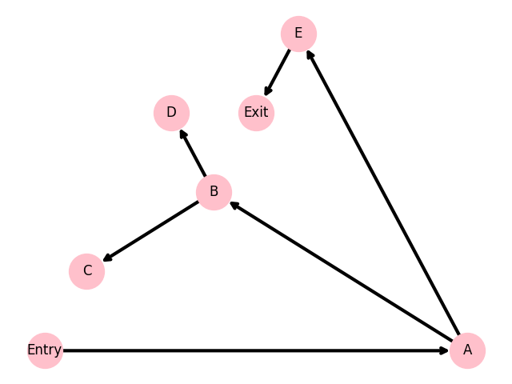

```
Entry

Block A [4]
(1) 	k <-- n
(2) 	b <-- #1
(3) 	c <-- a
(4) 	ifTrue k = #0 goto L4

Block B [2]
(5) 	L1: t1 <-- %mod, k, #2
(6) 	ifFalse t1 = #0 goto L2

Block C [3]
(7) 	k <-- %div, k, #2
(8) 	c <-- *, c, c
(9) 	goto L3

Block D [2]
(10)	b <-- *, b, c
(11)	c <-- *, b, c

Block E [4]
(12)	L2: k <-- -, k, #1
(13)	k <-- %div, k, #2
(14)	c <-- *, c, c
(15)	b <-- *, b, c

Block F [1]
(16)	L3: goto L1

Block G [2]
(17)	c <-- *, c, c
(18)	k <-- %div, k, #4

Block H [1]
(19)	L4: return c

Exit
```

Detached blocks : ```{D, G}```

### Control Flow Graph


### Dominator Tree



| node =     | Entry   | A        | B           | C              | E              | F              | H           | Exit              |
|:-----------|:--------|:---------|:------------|:---------------|:---------------|:---------------|:------------|:------------------|
| Pred(node) | None    | Entry    | A, F        | B              | B              | C, E           | A           | H                 |
| Dom(node)  | Entry   | Entry, A | Entry, A, B | Entry, A, B, C | Entry, A, B, E | Entry, A, B, F | Entry, A, H | Entry, A, H, Exit |
| Idom(node) | None    | Entry    | A           | B              | B              | B              | A           | H                 |
| DF(node)   | None    | None     | B           | F              | F              | B              | None        | None              |

```
Entry-block:
	def_Entry : {}
A-block:
	def_A : {}
	k <-- n
		Globals : {n}
		def_A : {k}
		Blocks(k) : {A}
	b <-- #1
		def_A : {b, k}
		Blocks(b) : {A}
	c <-- a
		Globals : {a, n}
		def_A : {b, c, k}
		Blocks(c) : {A}
	ifTrue k = #0 goto L4
B-block:
	def_B : {}
	L1: t1 <-- %mod, k, #2
		Globals : {a, k, n}
		def_B : {t1}
		Blocks(t1) : {B}
	ifFalse t1 = #0 goto L2
C-block:
	def_C : {}
	k <-- %div, k, #2
		Globals : {a, k, n}
		def_C : {k}
		Blocks(k) : {A, C}
	c <-- *, c, c
		Globals : {a, c, k, n}
		def_C : {c, k}
		Blocks(c) : {A, C}
	goto L3
E-block:
	def_E : {}
	L2: k <-- -, k, #1
		Globals : {a, c, k, n}
		def_E : {k}
		Blocks(k) : {A, C, E}
	k <-- %div, k, #2
		def_E : {k}
		Blocks(k) : {A, C, E}
	c <-- *, c, c
		Globals : {a, c, k, n}
		def_E : {c, k}
		Blocks(c) : {A, C, E}
	b <-- *, b, c
		Globals : {a, b, c, k, n}
		def_E : {b, c, k}
		Blocks(b) : {A, E}
F-block:
	def_F : {}
	L3: goto L1
H-block:
	def_H : {}
	L4: return c
		Globals : {a, b, c, k, n}
Exit-block:
	def_Exit : {}
```

| var =       | a    | b    | c       | k       | n    | t1    |
|:------------|:-----|:-----|:--------|:--------|:-----|:------|
| Blocks(var) | None | A, E | A, C, E | A, C, E | None | B     |
| is Global   | True | True | True    | True    | True | False |

```
variable n:
	WorkList : {}
variable k:
	WorkList : {A, C, E}
	insert phi(*k) in F-block
	WorkList : {A, C, E, F}
	insert phi(*k) in B-block
	WorkList : {A, B, C, E, F}
variable c:
	WorkList : {A, C, E}
	insert phi(*c) in F-block
	WorkList : {A, C, E, F}
	insert phi(*c) in B-block
	WorkList : {A, B, C, E, F}
variable a:
	WorkList : {}
variable b:
	WorkList : {A, E}
	insert phi(*b) in F-block
	WorkList : {A, E, F}
	insert phi(*b) in B-block
	WorkList : {A, B, E, F}
```

### Needs a phi-function:

| block =   | Entry   | A   | B   | C   | D   | E   | F   | G   | H   | Exit   |
|:----------|:--------|:----|:----|:----|:----|:----|:----|:----|:----|:-------|
| a         | -       | -   | -   | -   | -   | -   | -   | -   | -   | -      |
| b         | -       | -   | +   | -   | -   | -   | +   | -   | -   | -      |
| c         | -       | -   | +   | -   | -   | -   | +   | -   | -   | -      |
| k         | -       | -   | +   | -   | -   | -   | +   | -   | -   | -      |
| n         | -       | -   | -   | -   | -   | -   | -   | -   | -   | -      |
| t1        | -       | -   | -   | -   | -   | -   | -   | -   | -   | -      |

```
Rename(Entry):
    no phi-functions
    no instructions
    fill(A):
        no phi-functions
    Rename(A):
        no phi-functions
        rename instructions:
```
|   vars = | n   | k   | c   | a   | b   |
|---------:|:----|:----|:----|:----|:----|
|        0 | n_0 | -   | -   | -   | -   |

```
```
|   vars = | n   | k   | c   | a   | b   |
|---------:|:----|:----|:----|:----|:----|
|        0 | n_0 | k_0 | -   | -   | -   |

```
            k_0 <-- n_0
```
|   vars = | n   | k   | c   | a   | b   |
|---------:|:----|:----|:----|:----|:----|
|        0 | n_0 | k_0 | -   | -   | b_0 |

```
            b_0 <-- #1
```
|   vars = | n   | k   | c   | a   | b   |
|---------:|:----|:----|:----|:----|:----|
|        0 | n_0 | k_0 | -   | a_0 | b_0 |

```
```
|   vars = | n   | k   | c   | a   | b   |
|---------:|:----|:----|:----|:----|:----|
|        0 | n_0 | k_0 | c_0 | a_0 | b_0 |

```
            c_0 <-- a_0
            ifTrue k_0 = #0 goto L4
        fill(H):
            no phi-functions
        fill(B):
            b_0 <-- phi(b_0)
            c_0 <-- phi(c_0)
            k_0 <-- phi(k_0)
        Rename(H):
            no phi-functions
            rename instructions:
                L4: return c_0
            fill(Exit):
                no phi-functions
            Rename(Exit):
                no phi-functions
                no instructions
                clean();
```
|   vars = | n   | k   | c   | a   | b   |
|---------:|:----|:----|:----|:----|:----|
|        0 | n_0 | k_0 | c_0 | a_0 | b_0 |

```
                return to H;
            clean();
```
|   vars = | n   | k   | c   | a   | b   |
|---------:|:----|:----|:----|:----|:----|
|        0 | n_0 | k_0 | c_0 | a_0 | b_0 |

```
            return to A;
        Rename(B):
            rename phi-functions:
```
|   vars = | n   | k   | c   | a   | b   |
|---------:|:----|:----|:----|:----|:----|
|        0 | n_0 | k_0 | c_0 | a_0 | b_0 |
|        1 | -   | -   | -   | -   | b_1 |

```
                b_1 <-- phi(b_0)
```
|   vars = | n   | k   | c   | a   | b   |
|---------:|:----|:----|:----|:----|:----|
|        0 | n_0 | k_0 | c_0 | a_0 | b_0 |
|        1 | -   | -   | c_1 | -   | b_1 |

```
                c_1 <-- phi(c_0)
```
|   vars = | n   | k   | c   | a   | b   |
|---------:|:----|:----|:----|:----|:----|
|        0 | n_0 | k_0 | c_0 | a_0 | b_0 |
|        1 | -   | k_1 | c_1 | -   | b_1 |

```
                k_1 <-- phi(k_0)
            rename instructions:
                L1: t1 <-- %mod, k_1, #2
            fill(E):
                no phi-functions
            fill(C):
                no phi-functions
            Rename(C):
                no phi-functions
                rename instructions:
```
|   vars = | n   | k   | c   | a   | b   |
|---------:|:----|:----|:----|:----|:----|
|        0 | n_0 | k_0 | c_0 | a_0 | b_0 |
|        1 | -   | k_1 | c_1 | -   | b_1 |
|        2 | -   | k_2 | -   | -   | -   |

```
                    k_2 <-- %div, k_1, #2
```
|   vars = | n   | k   | c   | a   | b   |
|---------:|:----|:----|:----|:----|:----|
|        0 | n_0 | k_0 | c_0 | a_0 | b_0 |
|        1 | -   | k_1 | c_1 | -   | b_1 |
|        2 | -   | k_2 | c_2 | -   | -   |

```
                    c_2 <-- *, c_1, c_1
                fill(F):
                    b_0 <-- phi(b_1)
                    c_0 <-- phi(c_2)
                    k_0 <-- phi(k_2)
                clean();
```
|   vars = | n   | k   | c   | a   | b   |
|---------:|:----|:----|:----|:----|:----|
|        0 | n_0 | k_0 | c_0 | a_0 | b_0 |
|        1 | -   | k_1 | c_1 | -   | b_1 |

```
                return to B;
            Rename(E):
                no phi-functions
                rename instructions:
```
|   vars = | n   | k   | c   | a   | b   |
|---------:|:----|:----|:----|:----|:----|
|        0 | n_0 | k_0 | c_0 | a_0 | b_0 |
|        1 | -   | k_1 | c_1 | -   | b_1 |
|        2 | -   | k_3 | -   | -   | -   |

```
                    L2: k_3 <-- -, k_1, #1
```
|   vars = | n   | k   | c   | a   | b   |
|---------:|:----|:----|:----|:----|:----|
|        0 | n_0 | k_0 | c_0 | a_0 | b_0 |
|        1 | -   | k_1 | c_1 | -   | b_1 |
|        2 | -   | k_3 | -   | -   | -   |
|        3 | -   | k_4 | -   | -   | -   |

```
                    k_4 <-- %div, k_3, #2
```
|   vars = | n   | k   | c   | a   | b   |
|---------:|:----|:----|:----|:----|:----|
|        0 | n_0 | k_0 | c_0 | a_0 | b_0 |
|        1 | -   | k_1 | c_1 | -   | b_1 |
|        2 | -   | k_3 | c_3 | -   | -   |
|        3 | -   | k_4 | -   | -   | -   |

```
                    c_3 <-- *, c_1, c_1
```
|   vars = | n   | k   | c   | a   | b   |
|---------:|:----|:----|:----|:----|:----|
|        0 | n_0 | k_0 | c_0 | a_0 | b_0 |
|        1 | -   | k_1 | c_1 | -   | b_1 |
|        2 | -   | k_3 | c_3 | -   | b_2 |
|        3 | -   | k_4 | -   | -   | -   |

```
                    b_2 <-- *, b_1, c_3
                fill(F):
                    b_0 <-- phi(b_1, b_2)
                    c_0 <-- phi(c_2, c_3)
                    k_0 <-- phi(k_2, k_4)
                clean();
```
|   vars = | n   | k   | c   | a   | b   |
|---------:|:----|:----|:----|:----|:----|
|        0 | n_0 | k_0 | c_0 | a_0 | b_0 |
|        1 | -   | k_1 | c_1 | -   | b_1 |

```
                return to B;
            Rename(F):
                rename phi-functions:
```
|   vars = | n   | k   | c   | a   | b   |
|---------:|:----|:----|:----|:----|:----|
|        0 | n_0 | k_0 | c_0 | a_0 | b_0 |
|        1 | -   | k_1 | c_1 | -   | b_1 |
|        2 | -   | -   | -   | -   | b_3 |

```
                    b_3 <-- phi(b_1, b_2)
```
|   vars = | n   | k   | c   | a   | b   |
|---------:|:----|:----|:----|:----|:----|
|        0 | n_0 | k_0 | c_0 | a_0 | b_0 |
|        1 | -   | k_1 | c_1 | -   | b_1 |
|        2 | -   | -   | c_4 | -   | b_3 |

```
                    c_4 <-- phi(c_2, c_3)
```
|   vars = | n   | k   | c   | a   | b   |
|---------:|:----|:----|:----|:----|:----|
|        0 | n_0 | k_0 | c_0 | a_0 | b_0 |
|        1 | -   | k_1 | c_1 | -   | b_1 |
|        2 | -   | k_5 | c_4 | -   | b_3 |

```
                    k_5 <-- phi(k_2, k_4)
                no instructions
                fill(B):
                    b_1 <-- phi(b_0, b_3)
                    c_1 <-- phi(c_0, c_4)
                    k_1 <-- phi(k_0, k_5)
                clean();
```
|   vars = | n   | k   | c   | a   | b   |
|---------:|:----|:----|:----|:----|:----|
|        0 | n_0 | k_0 | c_0 | a_0 | b_0 |
|        1 | -   | k_1 | c_1 | -   | b_1 |

```
                return to B;
            clean();
```
|   vars = | n   | k   | c   | a   | b   |
|---------:|:----|:----|:----|:----|:----|
|        0 | n_0 | k_0 | c_0 | a_0 | b_0 |

```
            return to A;
        clean();
```
|   vars = | n   | k   | c   | a   | b   |
|---------:|:----|:----|:----|:----|:----|
|        0 | n_0 | -   | -   | a_0 | -   |

```
        return to Entry;
    clean();
```
|   vars = | n   | k   | c   | a   | b   |
|---------:|:----|:----|:----|:----|:----|
|        0 | n_0 | -   | -   | a_0 | -   |

```
```

```
Entry

Block A [4]
(1) 	k_0 <-- n_0
(2) 	b_0 <-- #1
(3) 	c_0 <-- a_0
(4) 	ifTrue k_0 = #0 goto L4

Block B [5]
(5) 	L1: b_1 <-- phi(b_0, b_3)
(6) 	c_1 <-- phi(c_0, c_4)
(7) 	k_1 <-- phi(k_0, k_5)
(8) 	t1 <-- %mod, k_1, #2
(9) 	ifFalse t1 = #0 goto L2

Block C [3]
(10)	k_2 <-- %div, k_1, #2
(11)	c_2 <-- *, c_1, c_1
(12)	goto L3

Block D [1]
(13)	pass

Block E [4]
(14)	L2: k_3 <-- -, k_1, #1
(15)	k_4 <-- %div, k_3, #2
(16)	c_3 <-- *, c_1, c_1
(17)	b_2 <-- *, b_1, c_3

Block F [4]
(18)	L3: b_3 <-- phi(b_1, b_2)
(19)	c_4 <-- phi(c_2, c_3)
(20)	k_5 <-- phi(k_2, k_4)
(21)	goto L1

Block G [1]
(22)	pass

Block H [1]
(23)	L4: return c_0

Exit
```

